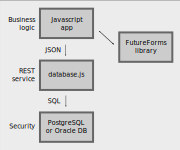

# FutureForms Hello demo

This demonstration shows how the FutureForms library
makes it easy to create a HTML table and connect
it to database table.

The idea with FutureForms is to write most of the
application in only Typescript (Javascript). 
If there is security requirements it will be handled
in the database.
The generic middle layer *database.js* is a REST API
which serves access to a database.

## Installation

The installation can be made with the script [install.sh](install.sh)
or it can be made manually.

Create a new folder and run **install.sh** in there.

The script will clone the following git repositories:

* [database.js](https://github.com/miracle-42/database.js) REST API
* [forms42.core](https://github.com/miracle-42/forms42.core) FutureForms library
* [futureforms.hello](https://github.com/miracle-42/futureforms.hello) Hello demo

The following packages will be install:

* PostgreSQL - create database *hello*
* OpenJDK Java - used by database.js web service
* npm - NodeJS and Typescript compiler
* git - repo tool
* unzip

